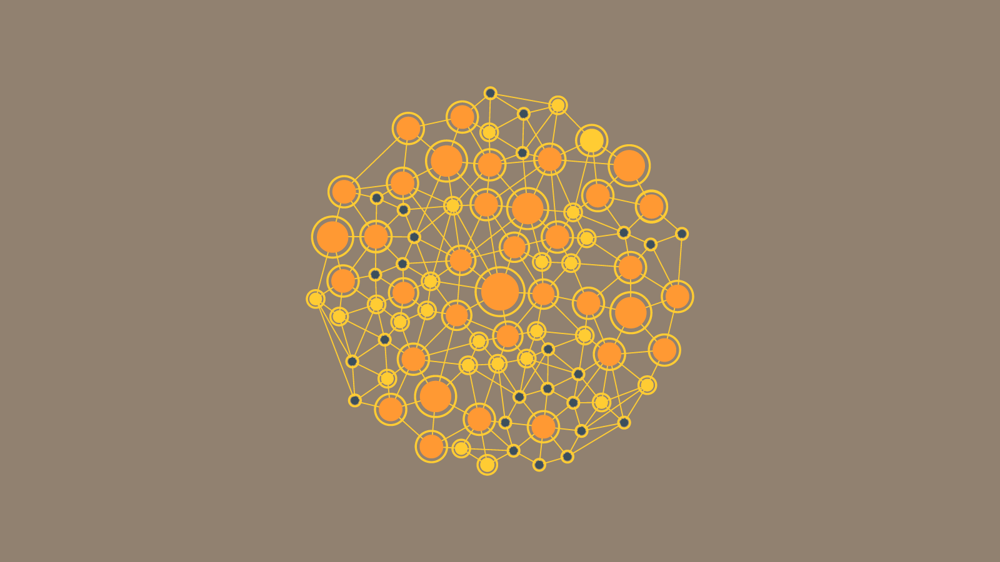
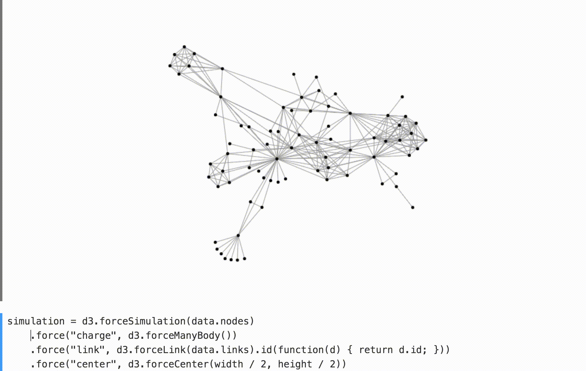
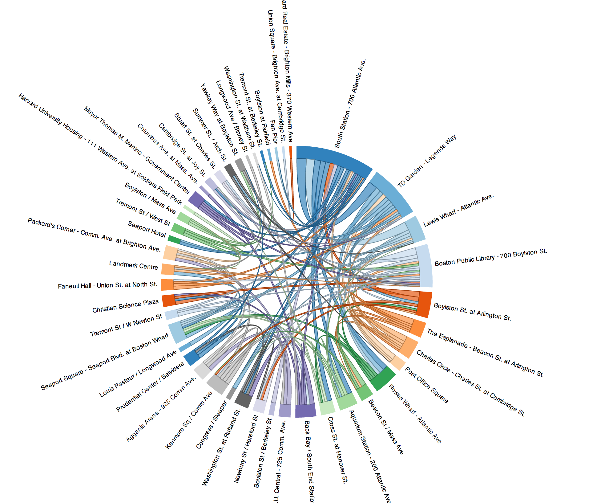
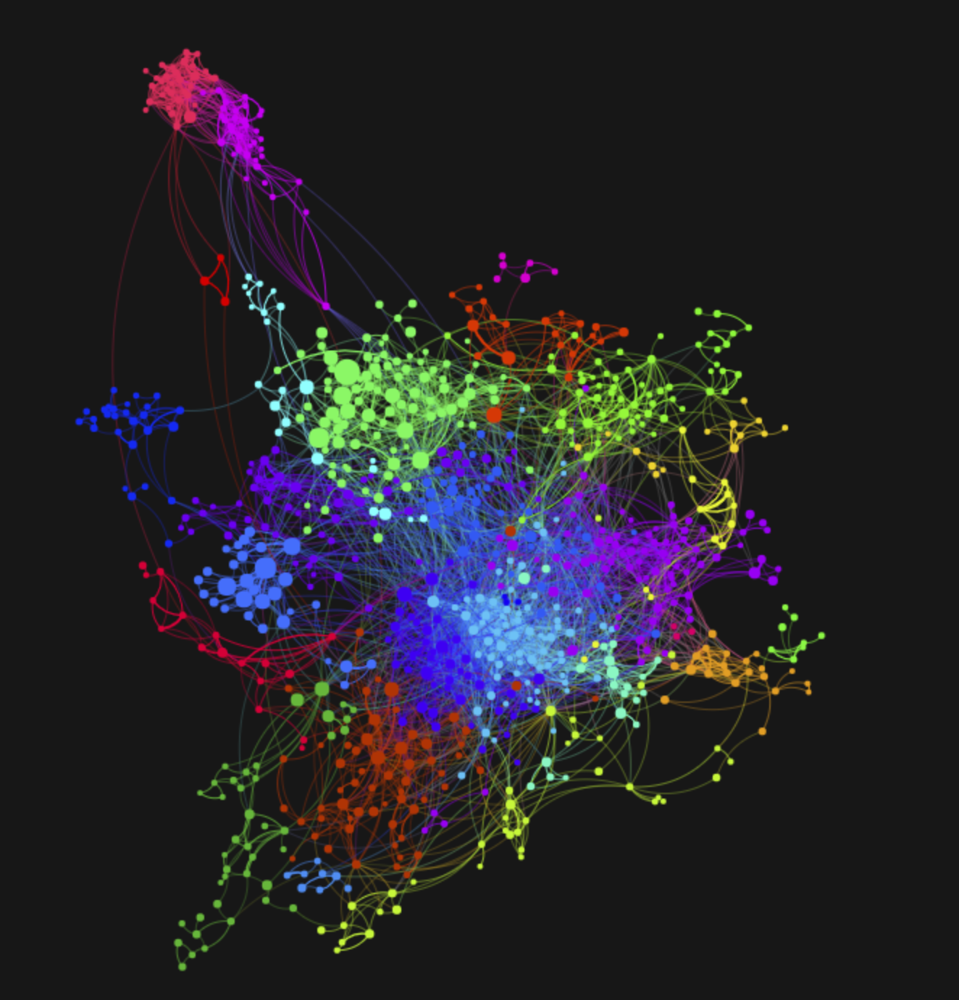
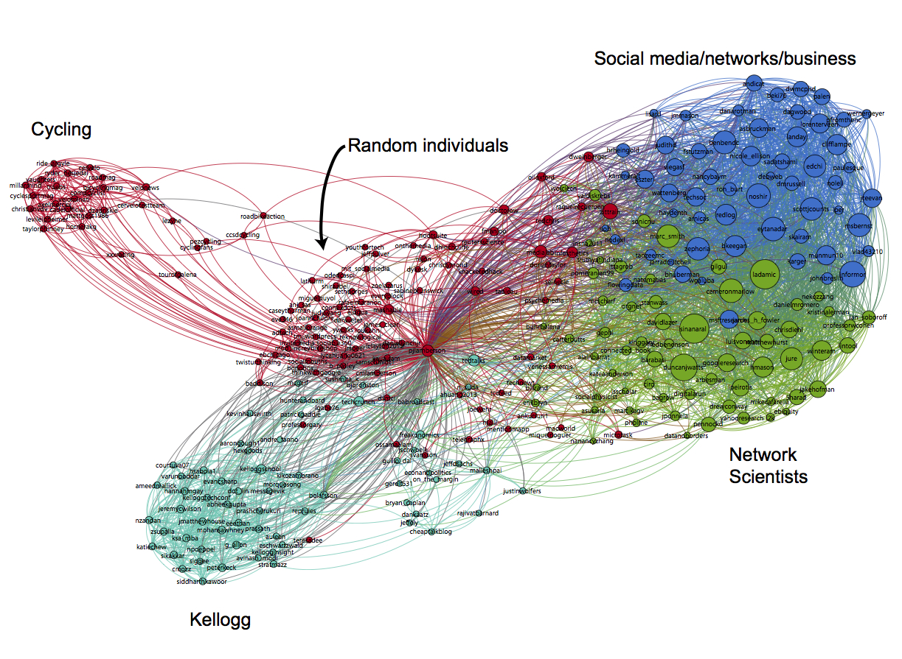

# Node-link diagrams

## Introduction
Node-link diagrams, also called graphs, or network diagrams, are diagrams that display connection between different elements. The graph consists of a set of nodes, some of which are connected with vertices.
The nodes of the node-link diagram represent the different elements that are studied. They are displayed on a plane, most often represented as bubbles of colors. If a "connexion" exists between two of these elements, we draw a vertice between them.

<table border="0">
  <tr>
    <td>
      
    </td>
  </tr>
  <tr>
    <td align="center" bgcolor="EFEFEF">
      First example of a node-link diagram [1]
    </td>
  </tr>
</table>

A lot of variants exist of node-link diagrams. Here are a few elements that can vary and make it interesting to study :

***Position of nodes on the plane***

If the nodes a positionned randomly on the plane, the data can be hard to interpret because of the entanglement of the connexions between the nodes. In order to avoid this, the positionning of the different elements on the plane can be done in a various number of ways :

- Force-based visualisation:

This method is based on physics and mathematics : we modelise a repulsion force between the nodes (such as a magnetic force between two particles positvely charged : the closer the nodes, the greater the force), as well as an attraction force between two connected particule (such as a spring : the further the nodes, the stronger the force). The system is then unleashed, and we can display the system at rest. Physics are well made, and this gives a pretty good results which intuitively minimises the size of the connections, without crushing everything together.
Sometimes, these graphs are displayed in a dynamic system that make it possible to interact with the nodes: by dragging one node with the mouse, the graph rearranges itself based on the forces, which allows a nice user-experience.

<table border="0">
  <tr>
    <td>
      
    </td>
  </tr>
  <tr>
    <td align="center" bgcolor="EFEFEF">
      Example of force based positionnement of nodes [2]
    </td>
  </tr>
</table>

- Circle:

Another possible way of positionning the node is to display them in a circle, and have all the connections inside the circle. This makes it relatively easy to read, since all connections do not overlap with nodes. Most of the time it is coupled with colors of the nodes and the connections, which makes beautiful representations.
Below is an example where nodes represent the stations of a bike-sharing system in Boston, and the connections represents the trips between these stations.

<table border="0">
  <tr>
    <td>
      
    </td>
  </tr>
  <tr>
    <td align="center" bgcolor="EFEFEF">
      Example of cirlce-positionned nodes : Boston bike-sharing system.[3]
    </td>
  </tr>
</table>

-3D :
Finally, some link-nodes diagrams are represented in 3D space. This, in theory, allows a more compact representation of data, with more connections that would not intersect. However, this is alwys displayed on a 2D screen, and this makes it less of an advantage. Moreover, even with a dynamic user interface which lets us interact with the data, rotate it, etc.. Thhe result loses in clarity.

***Additional features:***
It is possible to add additional information to a node-link diagram in numerous ways. Let's consider the graph below and analyse the information displayed, and how it is displayed.

<table border="0">
  <tr>
    <td>
      
    </td>
  </tr>
  <tr>
    <td align="center" bgcolor="EFEFEF">
      Graph of the connection betwteen subreddits based on the subscribers.[4]
    </td>
  </tr>
</table>

This is a map of all the subreddits on the reddit website. Reddit is a huge forum that allows people ton interact on smaller forums called subreddits. Each subreddit deals with a paricular theme, and users can subscribe to them (or not) if they are interested in the content.
The graph below is a screenshot of <a href = http://www.jacobsilterra.com/subreddit_map/network/index.html>this website</a> that displays a map of Reddit, where each node represents a subreddit, and each link displays the information of the similarity between the two subreddits: if a lot of users that are in one subreddit are in the other one, then there will be a connection bewteen these two subreddits. However, this is not all of the data that is displayed :

- Size of bubbles:
The size of the bubbles can be used to display a quantitative information concerning the nodes.
Here, the size of the bubble represents the size of the subreddit, meaning the number of subsrcribers.

- Size of the links:
The width of the links is also a nice and intuitive way to display information concerning the importance of the connection between two nodes.
Here, the width of the link is proportionnal to the strength of the connection : if 100% of subscribers of the first subreddit are also subscribers of the other, then the connection will be strong.
This is also used in the bike-sharing system reprenstation above, where the size of the links is related to the number of trip between the 2 stations.

- Colors of bubbles :
It is always interesting to add colors on a data visualisation, and it is possible ton do so with node-link diagrams.
Here, the colors represent "clusters" of subreddit which have a common theme. For examples, the blue cluster on the left seems to be subreddits related to music, the green cluster on the right seems to be realted to programming, and the pink on top, far away from others, seems to be realted to pronography.

## Important examples

This type of graphs is important for visualising networks, and with the rise of internet, there are a lot of them that diserve to be visualised. The previous example with reddit is one, but all social networks such as Facebook, Twitter, etc..
For instance, here is a representation of a graph of a small portion of Twitter:

<table border="0">
  <tr>
    <td>
      
    </td>
  </tr>
  <tr>
    <td align="center" bgcolor="EFEFEF">
      Visualisation of a small portion of Twitter.[5]
    </td>
  </tr>
</table>

## Advantages and Drawbacks

### Advantages

* This is probably the most natural and easy way to display connections between similar elements.
* It becomes easy to visually spot groups of elements that a all linked tohether.

### Drawbacks

* The type of data that can be visualised this way is limited : data has to be about links someway or another.
* If the connections are numerous, the data can be hard to read or interpret

## Sources

* [1] First example of a Node-Link diagram: http://www.orangetreeglobal.com/common-type-data-visualisations-examples/
* [2] Force based positionnement of nodes: https://medium.com/@mbostock/a-better-way-to-code-2b1d2876a3a0
* [3] Example of cirlce-positionned nodes: Boston bike-sharing system: http://dev.assets.neo4j.com.s3.amazonaws.com/wp-content/uploads/2012/10/hubway_lg.png?_ga=2.110268741.1913023441.1516114120-918224082.1516114120
* [4] Map of Reddit: http://www.jacobsilterra.com/subreddit_map/network/index.html
* [5] Twitter: http://social-dynamics.org/twitter-network-data/
